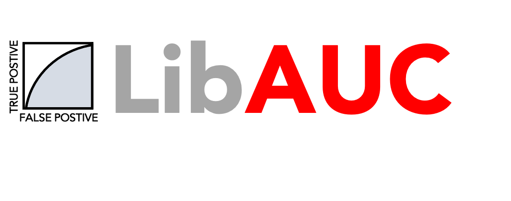

  

LibAUC
======
An end-to-end machine learning library for auc optimization.

Why is LibAUC?
---------------
Deep AUC Maximization (DAM) is a paradigm for learning a deep neural network by maximizing the AUC score of the model on a dataset. There are several benefits of maximizing AUC score over minimizing the standard losses, e.g., cross-entropy.

- In many domains, AUC score is the default metric for evaluating and comparing different methods. Directly maximizing AUC score can potentially lead to the largest improvement in the model’s performance.
- Many real-world datasets are usually imbalanced . AUC is more suitable for handling imbalanced data distribution since maximizing AUC aims to rank the predication score of any positive data higher than any negative data

Original Links
--------------

-  Repository: https://github.com/yzhuoning/libauc
-  Library website: https://libauc.org

How to install
--------------

::

   pip install libauc

Example
-------

1. Download the required datasets.
2. Run the following commands

::

   >>> ...
   >>> Losss = AUCMLoss(imratio=imratio)
   >>> optimizer = PESG(model, a=Loss.a, b=Loss.b, alpha=Loss.alpha, imratio=0.1, lr=lr, gamma=500, weight_decay=1e-5)
   >>> ...
   >>> loss = Loss(y_pred, targets)
   >>> optimizer.zero_grad()
   >>> loss.backward(retain_graph=True)
   >>> optimizer.step()
        

Copyright
---------
Apache License 2.0

Maintainer
----------

-  Zhuoning Yuan  `yzhuoning@gmail.com`

.. yzhuoning@gmail.com: yzhuoning@gmail.com
